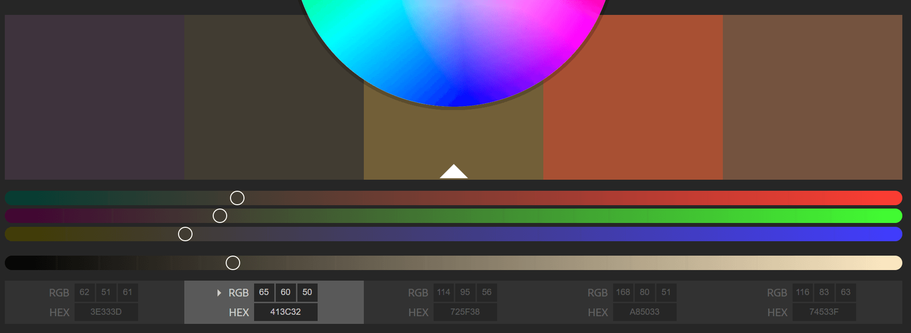
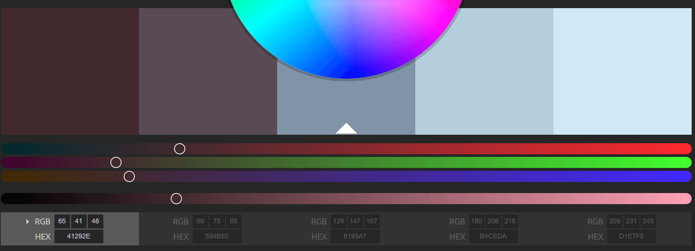

# Style Guide for Salmon Cookies

### Mission -
***
> To create a coffee time confection that is the perfect match for
> for a steaming cup of coffee on a grey Seattle morning.

> This snack is made with finely ground salmon and is then baked
> into a salmon shape cookie that represents the pacific northwest
> style.

### Target Audience - 
***
> Current target is utilizing tourism as it's main source of value
> as the novelty of a fish shape/fish taste cookie is a unique concept
> especially to be paired with a coffee-based drink. They will also be
> enjoyed by locals to create a sense of connection with the grey tones
> that Seattle itself expresses throughout the year.

### Logo/Color Scheme - 
***

> Above is the salmon. This is the main logo and concept of the cookie design.
> Taking this we have the current color swatch

> Next we have a free stock photo of a grey seattle

> We've come up with the following color swatch

### Overall Design Thought
***
> Originally the thought was to go a more homey approach with the warm colors of the
> salmon. The Pacific Northwest has a lot of forest, wood house feelings so it
> seemed appropriate but now I think that potentially using the skyline as a background,
> go a more minimalistic style that is modern and straight forward for both the user
> and the company management to see important information regarding shop progression

